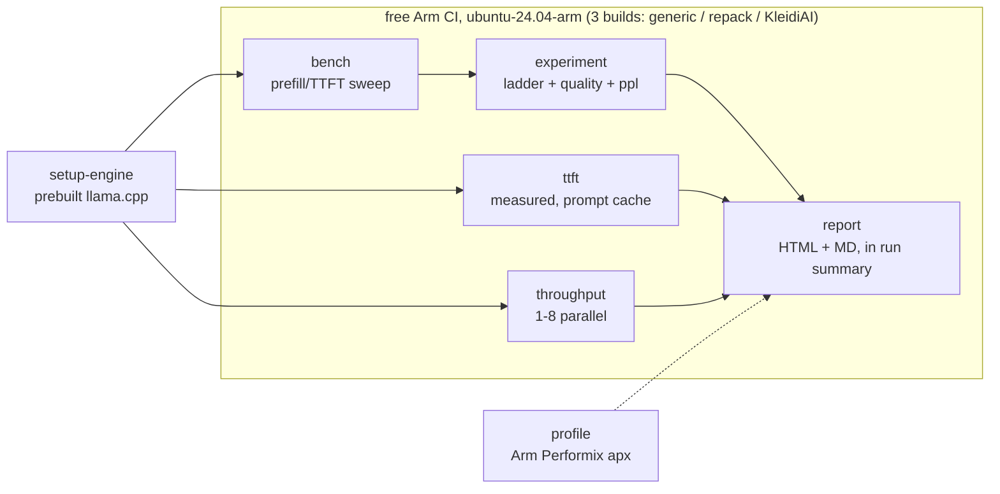

# Arm FirstFlight Attribution Ladder

**Which Arm optimization actually earned your speedup - measured, not assumed.**

> ### Your KleidiAI speedup is measured against the wrong baseline.
>
> A stock llama.cpp build already has Arm acceleration switched on: `GGML_NATIVE` and
> `GGML_CPU_REPACK` both default to ON. So the standard "KleidiAI on vs off" test credits
> KleidiAI with work ggml's own aarch64 kernels were already doing. And on Q4_K_M, the quant
> most people download, KleidiAI's kernels never engage at all.
>
> So I built the baseline nobody builds, and measured each mechanism on its own rung. On a
> free Arm runner: **ggml's repack does the work at Q4_0 - 3.60x - and KleidiAI adds 1.00x on
> top of it. At Q8_0, where repack can't reach, KleidiAI earns 1.23x.** That Q8_0 prediction
> was written down before the run. Ladders, noise floor and kernel evidence below.

[](LICENSE)
[](https://github.com/amaan784/arm-firstflight-infer-lab/actions/workflows/ci.yml)
[](https://github.com/amaan784/arm-firstflight-infer-lab/actions/workflows/arm-bench.yml)

Built for the **Arm Create: AI Optimization Challenge (Cloud AI track)**.

**Read the measured results:**
[Q4_0 report](bench/reports/report-20260814-230410.md) ·
[Q8_0 report](bench/reports/report-20260814-230412.md) ·
[raw result JSONs](bench/results/) ·
[the CI runs that produced them](https://github.com/amaan784/arm-firstflight-infer-lab/actions)

Those `.md` reports render here on GitHub. Each also has a **standalone one-file HTML twin**
next to it (`bench/reports/*.html`, charts embedded, no assets needed) which GitHub shows as
source rather than rendering, so download it or read the same report in the
[Actions run summary](https://github.com/amaan784/arm-firstflight-infer-lab/actions/runs/31784946201),
where CI publishes it directly.

---

## 1. Project Overview

### The problem with the standard benchmark

Everyone measures KleidiAI the same way: build llama.cpp normally, build it again with
`-DGGML_CPU_KLEIDIAI=ON`, compare. That test does not measure what it claims to measure,
for two reasons you can check in five minutes:

1. **The "before" build is already Arm-optimized.** In llama.cpp's own `ggml/CMakeLists.txt`,
   `GGML_NATIVE` defaults ON (native targeting, the `-mcpu=native`-equivalent) and
   `GGML_CPU_REPACK` defaults ON (ggml's own aarch64 Q4_0 repack GEMM, the same technique
   KleidiAI uses). So the comparison is one Arm optimization against another, and whatever
   number falls out gets credited entirely to KleidiAI.
2. **On the most-downloaded quant, the kernels never run.** KleidiAI has kernels for Q4_0 and
   Q8_0 only. Point it at a Q4_K_M GGUF, the default almost everyone downloads, and it
   silently falls back. Upstream now logs the fallback
   ([PR #25701](https://github.com/ggml-org/llama.cpp/pull/25701), merged 2026-07-21).

### What this harness does instead

It builds the true unaccelerated floor (`GGML_NATIVE=OFF`, `GGML_CPU_ARM_ARCH=armv8-a`,
`GGML_CPU_REPACK=OFF`) and measures a three-rung ladder against it, so every speedup names
its own mechanism:

```
generic armv8-a  →  + native targeting & ggml repack  →  + KleidiAI kernels
```

Then it does three things a benchmark normally won't:

- **Proves the kernels engaged.** It reads the weight-buffer line and ISA flags out of the
  model-load log and names the tier that ran (I8MM / DOTPROD / SVE2 / NEON). If the marker is
  missing, no claim is made.
- **Ships a negative control:** the KleidiAI build against Q4_K_M, where its kernels cannot
  engage. The probe must report INACTIVE; if it ever doesn't, the detection is broken and
  every other KleidiAI number here is void. Stated plainly: this one is **built but not yet
  run**. It sits behind `run_quant_sweep`, which also drags in ~11h of secondary sweeps and
  overruns the CI timeout, so it needs a runner you own. Nothing below depends on it.
- **Refuses to claim wins inside its own noise.** The same build is measured twice under two
  labels to establish a floor. A delta that doesn't clear it shows `within noise` on the
  metric card instead of a multiplier, and the headline reads `No claimed win`.

Measurements run on Arm Neoverse N2 (Azure Cobalt 100, the free `ubuntu-24.04-arm` runner)
and center on the metric agentic and RAG apps feel: time-to-first-token on long contexts.

### What the ladder actually measured

Qwen2.5-1.5B-Instruct Q4_0, 4 threads, free `ubuntu-24.04-arm` runner (Azure Cobalt 100,
Neoverse N2), median of 2 interleaved rounds.
[Full report](bench/reports/report-20260814-230410.md) ·
[raw results](bench/results/run-31656321896/) ·
[run 31656321896](https://github.com/amaan784/arm-firstflight-infer-lab/actions/runs/31656321896)

| prompt tokens | generic armv8-a | + native & ggml repack | + KleidiAI | repack vs generic | **KleidiAI vs repack** |
|---:|---:|---:|---:|---:|---:|
| 1,024 | 26.4 tok/s | 94.8 | 95.3 | **3.60x** | **1.01x** |
| 2,048 | 25.7 | 62.2 | 62.4 | **2.42x** | **1.00x** |
| 4,096 | 24.6 | 37.0 | 37.0 | **1.50x** | **1.00x** |
| 8,192 | 22.6 | 20.4 | 20.5 | 0.90x | **1.00x** |

**ggml's own aarch64 repack delivers the entire speedup. KleidiAI adds nothing measurable on
top of it at Q4_0.** Against a measured noise floor of **0.3%** (the same build run twice
under two labels), a 1.00x delta is a real null rather than a missing measurement, and the
3.60x is far outside it.

This is the thesis, measured: the usual "KleidiAI on vs off" A/B would have credited KleidiAI
with all 3.60x. The floor rung is what separates them.

The null is not a detection failure. Each rung loads a different weight buffer, straight from
the model-load log:

| rung | weight buffer | kernel tier |
|---|---|---|
| generic armv8-a | `CPU_Mapped` 1011.16 MiB | NEON |
| + native & repack | `CPU_REPACK` 885.41 MiB | I8MM |
| + KleidiAI | `CPU_KLEIDIAI` 702.86 MiB | I8MM |

KleidiAI engaged. It simply had nothing left to win, because repack had already taken it.
Perplexity is flat across all three rungs at Q4_0 (37.4325 / 37.4181 / 37.4181, a 0.04%
spread), so at this quant the kernel swap is output-neutral.

### Q8_0: the same ladder, the opposite answer

ggml's repack targets Q4_0. So if the Q4_0 null is really "repack got there first", KleidiAI
should have room at Q8_0. That prediction is written into the workflow, and this is the run
that tested it: `rag-context`, 3 repetitions.
[Full report](bench/reports/report-20260814-230412.md) ·
[raw results](bench/results/run-31784946201/) ·
[run 31784946201](https://github.com/amaan784/arm-firstflight-infer-lab/actions/runs/31784946201)

| prompt tokens | generic armv8-a | + native & ggml repack | + KleidiAI | repack vs generic | **KleidiAI vs repack** |
|---:|---:|---:|---:|---:|---:|
| 2,048 | 28.2 tok/s | 58.8 | 72.5 | 2.08x | **1.23x** |
| 4,096 | 26.9 | 35.8 | 40.3 | 1.33x | **1.13x** |
| 8,192 | 24.4 | 20.1 | 21.4 | 0.82x | **1.07x** |
| generation | 18.1 | 39.2 | 45.2 | 2.17x | **1.15x** |

**At Q8_0 KleidiAI earns its keep: 1.23x over repack at 2k, and 1.15x on generation.** The
kernel evidence says why. At Q4_0 the KleidiAI build reports `repack=on`; at Q8_0 it reports
`repack=off, kleidiai=on`, loading `CPU_KLEIDIAI` where repack cannot follow. A different
code path, not more of the same one.

So the standard benchmark is wrong in **both** directions. It hands KleidiAI credit it did
not earn at Q4_0, and it never tests the quant where it does.

**The speedup is not free.** Perplexity across the Q8_0 rungs spreads 1.43% (31.6267 to
32.0774), with KleidiAI the outlier, against 0.04% at Q4_0 where repack and KleidiAI agreed
to six significant figures. A 23% speedup that moves model output by 1.4% is a trade, and
the report labels it as one. A speed-only benchmark would ship it silently.

Two caveats, stated rather than buried: `run_q8_only` skips the noise-floor control, so these
deltas are weighed against the 0.3% floor measured at Q4_0 rather than one of their own; and
perplexity is a single measurement per rung, so the 1.43% has no error bar.

**Two secondary findings:**

- **The advantage inverts with context.** Generic is nearly flat as context grows (26.4 to
  22.6 tok/s) while the accelerated builds fall off a cliff (94.8 to 20.4), crossing over at
  8,192 tokens where they land 10% *behind* the floor. Once the matmul is fast, quadratic
  attention becomes the bottleneck. Peak RSS is identical at 1.3 GiB on every rung, so this
  is not memory pressure. The mechanism is not established here, only the measurement.
- **Prefix caching beats every kernel.** Measured from llama-server's own timings: cold TTFT
  8,492 ms, warm 54 ms on the same prefix. That is 99% of prefill skipped, against 0-1% for
  the kernel swap that this whole ladder exists to measure.

> Re-render any of it from the committed data:
> `firstflight report --results-dir bench/results/run-31656321896 --instance github-arm-runner`

**What it is.** A small, reproducible harness that measures where Arm CPU LLM inference
hurts (prefill / TTFT as context length grows) and how much Arm-specific optimization
recovers, in numbers a judge can re-run from CI.



## The optimization: baseline → changes → evidence

**Baseline:** stock llama.cpp CPU build, k-quant weights (Q4_K_M), default threading, on an
Arm Neoverse cloud instance. This is what most people deploy, and its long-context prefill is
the part users feel as time-to-first-token. It mirrors the Cloud AI track's first-listed
Learning Path, ["Deploy an LLM chatbot with llama.cpp using KleidiAI on Arm
servers"](https://learn.arm.com/learning-paths/servers-and-cloud-computing/llama-cpu/)
(Ubuntu 24.04, Graviton, GGUF, `-mcpu=native`). That official path never passes an
explicit KleidiAI cmake flag or verifies the kernels engaged. We pin the tag, enable
`-DGGML_CPU_KLEIDIAI=ON` explicitly, prove activation from the load log, and measure the
delta. Closing that gap is the optimization story.

**What we changed** (each change is Arm-specific and measured):

| # | Change | Mechanism on Arm | Where in this repo |
|---|---|---|---|
| 1 | **KleidiAI microkernels**: rebuild llama.cpp with `-DGGML_CPU_KLEIDIAI=ON` | Arm's KleidiAI kernels repack Q4_0/Q8_0 weights at load and route matmuls through dotprod / i8mm / SVE2 paths on Neoverse (KleidiAI also ships SME2 kernels, but no shipping Neoverse server core implements SME as of 2026-08; it's client silicon only) | built + compared automatically in [`arm-bench.yml`](.github/workflows/arm-bench.yml) (`kleidiai-before-after`), [`scripts/setup_arm_vm.sh`](scripts/setup_arm_vm.sh), [`docker/Dockerfile.arm64`](docker/Dockerfile.arm64) |
| 2 | **Quantization scheme chosen for the silicon**: Q4_0 instead of Q4_K_M | KleidiAI accelerates Q4_0, not k-quants (verified in ggml's kleidiai source), so the "default" quant silently opts out of Arm acceleration | [`configs/experiments.yaml`](configs/experiments.yaml) `quant-sweep` + `kleidiai` |
| 3 | **Thread count + CPU pinning** | `llama-bench -C/--cpu-mask + --cpu-strict` affinity on Neoverse cores | `thread-sweep` / `pinning` experiments |
| 3b | **Quantized KV-cache**: q8_0 cache vs f16 (`-ctk/-ctv`, flash-attn pinned on) | halves KV-cache footprint and eases the memory-bandwidth pressure that dominates long-context prefill on Neoverse | `kv-cache` experiment |
| 3c | **Prefill micro-batch + flash attention**: `-ub` 256→2048 sweep, `-fa` on/off | bigger micro-batches feed the KleidiAI/i8mm GEMM kernels larger tiles (the dominant prefill lever) | `prefill-batch` / `flash-attn` experiments |
| 3d | **Prompt/prefix caching**: llama-server `cache_prompt` + `--cache-reuse` | for agentic/RAG serving with a shared system prefix, the warm turn skips almost the entire prefill; the TTFT collapse is measured, not derived | `firstflight ttft` (server's own `timings`) |
| 4 | **Performix-ready profiling hooks + opt-in agent loop**: the wrapper implements Arm's documented `apx code_hotspots` recipe flow and renders top hotspots into the report when `apx` is present (sample report shows clearly-labeled demo hotspots until a box run lands); the `autotune` agent closes the propose→measure loop | attribution machinery is built and CI attempts it on every headline run (no-op without `apx`) | [`src/firstflight/profile/performix.py`](src/firstflight/profile/performix.py), [`src/firstflight/autotune/agent.py`](src/firstflight/autotune/agent.py) |

**The evidence:**
- Same instance, same model, only the optimization varies; warm-ups and repeats with
  variance (5 for the full prefill sweep, 3 for the experiment suite, 2 for the every-push CI
  smoke), fixed seeds + greedy decoding in the generation/quality probes. Protocol in
  [`docs/METHODOLOGY.md`](docs/METHODOLOGY.md).
- KleidiAI is proven active, not assumed: the harness greps the load log for the
  `CPU_KLEIDIAI` buffer marker and prints yes/no in the report's `kleidiai` column.
- A quality guardrail per config: an exact-match probe checks that the speedup did not cost
  accuracy.
- $/M-token from real prices (AWS pricing feed, dated in [`configs/instances.yaml`](configs/instances.yaml)).
- One click reproduces it: the `kleidiai-before-after` CI job builds llama.cpp three ways
  (generic armv8-a floor / native+repack default / KleidiAI), runs the attribution ladder in
  2 interleaved rounds plus a same-build noise-floor control, and the measured-TTFT and
  concurrency sweeps on a free Arm runner, then writes the report into the run summary. That
  is the ~2h50m default. The Q8_0 ladder runs standalone in ~2h via the `run_q8_only` input
  (that is the run that produced the KleidiAI result below). The remaining sweeps
  (build-flags, quant, KV-cache, micro-batch, negative control) add roughly 11 hours, past
  the job's 300-minute timeout, so they sit behind `run_quant_sweep` for a runner you own. (Thread/pinning/flash-attn
  sweeps run anywhere via `firstflight experiment --name …`.)
- Attribution is split by mechanism: a plain llama.cpp Release build already carries native
  targeting and ggml's own aarch64 Q4_0 repack kernels (`GGML_NATIVE`/`GGML_CPU_REPACK`
  default ON, verified in b9873's CMakeLists), so the ladder measures each mechanism on its
  own rung: generic → repack → KleidiAI, with the same-build spread published next to it.

## Why this exists: what the alternatives can't tell you

| Where people look today | What it gives you | What it can't say |
|---|---|---|
| `llama-bench` | An accurate tokens/sec number | Which mechanism produced it. Native targeting, ggml's repack and KleidiAI all land in one figure |
| The [AWS Graviton llama.cpp guide](https://github.com/aws/aws-graviton-getting-started) | `-mcpu=native`, and it works | Never mentions KleidiAI at all, so the kernel question is never asked |
| [Arm's own KleidiAI Learning Path](https://learn.arm.com/learning-paths/servers-and-cloud-computing/llama-cpu/) | A working chatbot on Graviton | Never passes the KleidiAI cmake flag, and never A/Bs against a build without it |
| Vendor blog posts ("up to 4× on Graviton") | A headline multiplier | Build config is usually undisclosed; whether the gain came from silicon, flags, repack or kernels is unknowable |
| General LLM benchmark suites | Cross-engine comparisons | Backend-agnostic by design: no Arm build-variant axis, no proof a kernel engaged |

This harness answers the question those leave open: which mechanism, how much, and with what
proof. Each rung of the ladder is a separate build, each speedup names its cause, activation
is read from the load log rather than assumed, and a delta inside the measured noise floor is
reported as no win rather than as a number.

**Reusable beyond this repo:** the pip-installable harness itself (adoption recipes:
[`docs/ADOPT.md`](docs/ADOPT.md)); a drop-in Arm CI template
([`docs/arm-bench-template.yml`](docs/arm-bench-template.yml)) that runs the three-build ladder
in any repo; the Performix `apx` wrapper (sourced from Arm's MCP server); the
KleidiAI quant-support constraint (Q4_0/Q8_0 only) written down with sources; the
measurement methodology; and the commit history: the repo was committed stage by
stage (foundation → benchmark → report → profiling → experiments → autotuner → integration →
hardening), so stepping through the commits replays how a rig like this gets assembled.

**How this maps to the challenge criteria.**
- **Technological Implementation:** a real, non-trivial Arm optimization axis (KleidiAI
  kernels at Q4_0 and Q8_0, build targeting, quant schemes) with measured deltas, a measured
  noise floor and kernel-level activation evidence, and negative results (KleidiAI's 1.00x at
  Q4_0; k-quants skipping it entirely) reported rather than hidden. Performix profiling is
  wired to Arm's documented `apx` recipe flow and renders into the report where `apx` is
  present; it is not on the GitHub runner, so the step reports a skip instead of pretending.
  Performix is the measurement tool the organizers recommend for Neoverse/cloud
  submissions ("use Arm Performix to measure and validate the impact of your optimizations",
  per the [challenge Getting Started
  update](https://arm-ai-optimization-challenge.devpost.com/updates)).
- **Wow factor:** an auto-generated one-page HTML report, led by the headline number.
- **Potential Impact:** TTFT on long contexts is the cost/UX bottleneck for agentic & RAG
  workloads on cloud CPUs, which is where Graviton/Ampere economics matter; every artifact
  above is reusable on any llama.cpp-on-Arm deployment.
- **Developer Experience:** `pip install -e . && firstflight setup-engine && firstflight smoke`
  on any machine; `make bench && make report` for the full run; reproducible from CI.

## 2. Functionality / Output

| Command | What it does |
| --- | --- |
| `firstflight setup-engine` | Downloads the prebuilt llama.cpp release for the current platform (Win/Linux/mac, x64/arm64) into `./engine`; real inference on any machine, no compiler. |
| `firstflight info` | Environment report: arch, Arm detection, llama.cpp binary, config summary. |
| `firstflight smoke` | Downloads the tiny Qwen2.5-0.5B GGUF and runs llama.cpp once to prove the pipeline on any machine (skips with a message if there is no binary). |
| `firstflight download` | Downloads model GGUFs from `configs/models.yaml` into `./models` only, to pre-cache before offline runs (other commands also fetch on demand). |
| `firstflight bench` | Prefill/TTFT + generation throughput + peak memory across context lengths (`configs/workloads.yaml`) via `llama-bench` → `bench/results/*.json`. `--dry-run` prints the command. |
| `firstflight run` | A single (context-length, gen) point for quick iteration. |
| `firstflight ttft` | Measured TTFT via `llama-server`'s own `timings` + the prompt-cache demo: same long prefix, cold vs warm turn → prefill-time collapse with `--cache-reuse`. |
| `firstflight throughput` | Concurrency axis: aggregate tok/s at 1/2/4/8 parallel requests via `llama-batched-bench`; the serving-throughput side of the agentic/RAG case. |
| `firstflight profile` | Runs Arm Performix (`apx` recipe `code_hotspots`) on a prefill run and surfaces the top hotspot functions into the report; no-ops off Arm. |
| `firstflight experiment` | The optimization axis: benchmarks a set of configs from `configs/experiments.yaml` (quant scheme / threads / CPU pinning / KleidiAI build) with model + instance held fixed, runs a quality probe per config, detects whether KleidiAI is active (load-log proof), and renders the before/after report, proving both the delta and that accuracy held. |
| `firstflight perplexity` | Perplexity over a fixed corpus via `llama-perplexity`; the finer quality instrument (the 40-item probe can't resolve ~1% shifts). Also runs automatically per experiment config. |
| `firstflight report` | Renders the before/after markdown + standalone HTML report (headline, charts, $/M-token, quality) from `bench/results/*.json` → `bench/reports/`. `--demo` previews the layout with synthetic data. |
| `firstflight autotune --enable` | _(stretch, opt-in)_ Agent-in-the-loop optimizer: proposes a config → benchmarks → loops until no improvement. Default heuristic-grid proposer (no API key); `--llm` uses Claude (the `[agent]` extra). |

**Final output:** the optimized config plus the auto-generated report
(`bench/reports/*.html` and `*.md`), plus structured results in `bench/results/*.json`.

## 3. Setup Instructions

### Any machine: real inference in three commands (no compiler needed)
```bash
python -m venv .venv && . .venv/bin/activate      # Windows: .venv\Scripts\activate
# or conda: conda create -n firstflight python=3.12 -y && conda activate firstflight
pip install -e ".[report,dev]"
firstflight setup-engine     # auto-downloads the prebuilt llama.cpp for THIS platform
firstflight smoke            # real model download + real generation, Win/Linux/mac, x64/arm64
```
(`make smoke` etc. work on Linux/macOS/Git Bash; plain `firstflight` commands work everywhere.)
Without an engine (`setup-engine` not run, no `LLAMA_CPP_BIN`), every command skips with a
clear message instead of crashing.

### Path A: free Arm execution via GitHub Actions (the judge path)
Push to a public GitHub repo and dispatch the `arm-bench` workflow
(`.github/workflows/arm-bench.yml`) on a free GitHub-hosted `ubuntu-24.04-arm` runner.
These runners are the subject of [Arm's own Learning
Path](https://learn.arm.com/learning-paths/cross-platform/github-arm-runners/) (native Arm64
execution, no emulation); the free public-repo runners are Azure Cobalt 100 (Arm Neoverse
N2, 4 vCPU, Armv9-A + SVE2), the same hyperscaler cloud silicon the Cloud AI track names.
The hackathon provides no cloud credits or hosted environment, so this path lets anyone,
including judges, reproduce the numbers at zero cost:

- `smoke-arm` (every push to `main` touching `src/`/`configs/`, and on every dispatch):
  real inference + baseline prefill sweep + report.
- `kleidiai-before-after` (one dispatch): builds llama.cpp three ways (a generic
  armv8-a floor with `GGML_NATIVE=OFF` and `GGML_CPU_REPACK=OFF`, the native+repack default,
  and the KleidiAI build) and runs the full evidence suite on the same Q4_0 model: the
  attribution ladder (interleaved rounds, up to 8k context) with active-detection +
  quality guardrail + perplexity, the same-build noise-floor control, the
  Q8_0/Q4_K_M/Q4_0 quant sweep, the KV-cache and ubatch experiments, the build-flags
  comparison, the measured-TTFT prompt-cache demo, and the concurrency sweep.

Both render the report into the workflow run summary (no artifact download needed
to see the numbers) and upload the standalone HTML report + JSON results as an artifact.

> **For judges / anyone without write access:** `Run workflow` needs write permission, so
> fork the repo first, enable workflows on the fork when GitHub asks, then dispatch
> `arm-bench` there. The fork gets the same free Arm runners and the same report in the
> run summary.

### Path B: remote Arm VM (for bigger models)
On a fresh Ubuntu 24.04 aarch64 instance: AWS Graviton `t4g`/`c7g`/`c8g` (primary;
matches Arm's Learning Paths), Google Axion `c4a` or Azure Cobalt (also named by the track),
or Oracle Ampere A1 (budget/Always-Free option):
```bash
bash scripts/setup_arm_vm.sh           # build llama.cpp (+KleidiAI) + deps; prints the Performix install-guide pointer (manual step)
. .venv/bin/activate                   # picks up firstflight + LLAMA_CPP_BIN
make bench && make report              # run + render
```
Or drive it from your laptop over SSH:
```bash
bash scripts/run_remote.sh --host user@<arm-ip> --key ~/.ssh/id_ed25519
```

### Reproducibility
The whole run is one command on an Arm box: `make bench && make report`. Measurement
protocol (warm-ups, fixed seeds, repeats, variance, same-instance before/after) is documented
in [`docs/METHODOLOGY.md`](docs/METHODOLOGY.md).

---

## Repo layout
```
configs/        models.yaml · instances.yaml · workloads.yaml · experiments.yaml
src/firstflight/ cli · runner · engines/ · profile/ · bench/ · eval/ · cost · report/ · autotune/
bench/          results/ (JSON) · reports/ (generated)
docker/         Dockerfile.arm64 (reproducible aarch64 env)
scripts/        setup_arm_vm.sh · run_remote.sh
docs/           EXPLAINER.md (concepts) · METHODOLOGY.md · RUNBOOK.md · ADOPT.md (+ CI template) · DEMO_SCRIPT.md · DEVPOST.md (submission draft) · CONFIRM_ON_ARM.md
.github/workflows/ ci.yml (lint+test) · arm-bench.yml (free Arm benchmarks)
```
(`engine/` and `models/` are created at runtime by `setup-engine`/`download` and stay untracked.)

## License
[MIT](LICENSE). Open source, as required by the hackathon.

_Official challenge channels: [Arm Developer Program](https://developer.arm.com) ·
[Arm Learning Paths](https://learn.arm.com) ·
[Arm Developer Ecosystem GitHub](https://github.com/ArmDeveloperEcosystem) ·
the Arm Developer Program Discord._

---
_Some Arm-box-only specifics (exact Performix `apx` subcommands & output parsing, KleidiAI
flags for the pinned llama.cpp tag, instance hourly prices) are marked `TODO(confirm)` in the
code and verified on the live Arm box rather than invented. The consolidated list, including
what was already verified, is in [`docs/CONFIRM_ON_ARM.md`](docs/CONFIRM_ON_ARM.md)._
