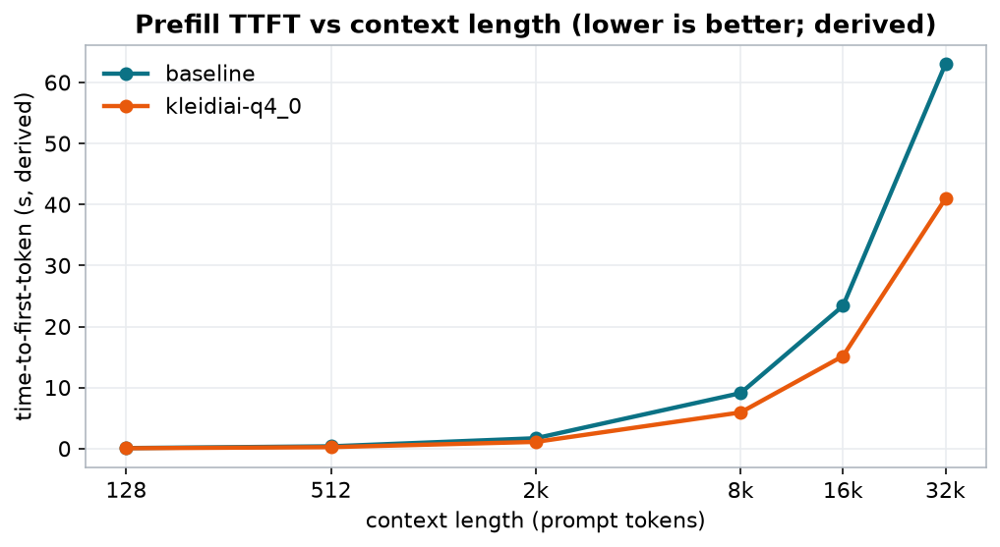
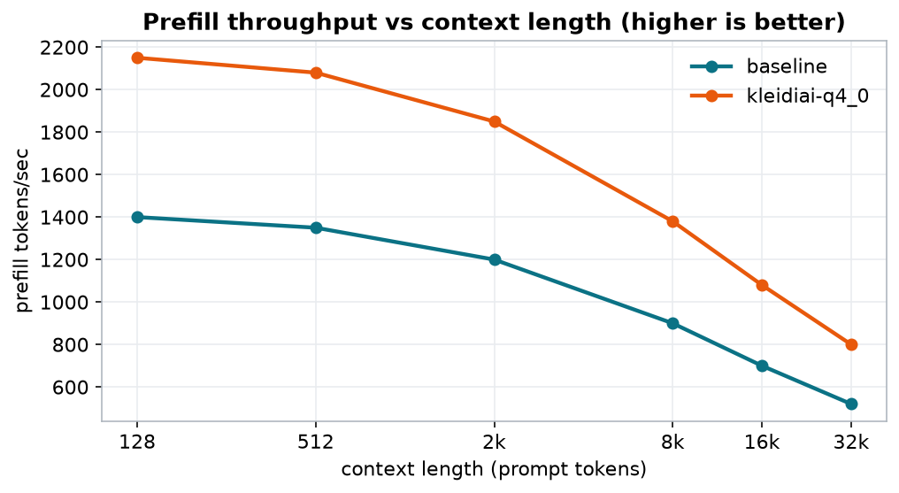
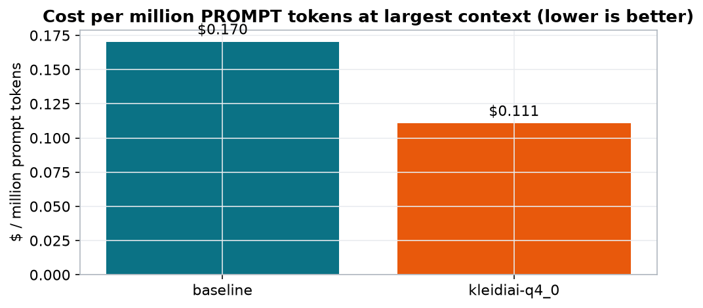

> **DEMO - synthetic illustrative data, not a measured run.**

# Arm FirstFlight - Inference Optimization Report

## 1.54x faster prefill at 32,768-token context

- TTFT 63.02s -> 40.96s at 32,768 tokens (kleidiai-q4_0 vs baseline)
- prefill 520 -> 800 tok/s
- generation 55 -> 85 tok/s
- prompt cost $0.1704 -> $0.1108 per M tokens at 32,768-token context
- generation cost $1.6111 -> $1.0425 per M tokens
- quality 32/40 -> 32/40 (held)
- measured prompt-cache TTFT: cold 1620ms -> warm 42ms (97% less prefill on the warm turn)

| 1.54x | 40.96s | 800 | $0.1108 | 32/40 |
|---|---|---|---|---|
| prefill speedup @ 32k | TTFT @ 32k (kleidiai-q4_0) | prefill tok/s | $/M prompt tok @ 32k | quality (probe) |

### Prefill TTFT vs context length (lower is better; derived)

### Prefill throughput vs context length (higher is better)

### Cost per million prompt tokens

## Runs

| label | model:variant | threads | build | kleidiai | gen tok/s | peak mem | $/M prompt tok | $/M gen tok | quality |
|---|---|---:|---|---|---:|---:|---:|---:|---:|
| baseline | qwen2.5-0.5b-instruct:q4_k_m | 8 | b9873 | no | 55 | 730.0 MiB | $0.1704 | $1.6111 | 32/40 |
| kleidiai-q4_0 | qwen2.5-0.5b-instruct:q4_0 | 8 | b9873 | yes | 85 | 690.0 MiB | $0.1108 | $1.0425 | 32/40 |

## Prefill scaling (TTFT seconds / prefill tok/s ± stddev)

_TTFT is derived as prompt_tokens ÷ prefill throughput; it excludes tokenization and model-load time. ± is the spread across repetitions._

| context | baseline TTFT | baseline tok/s | kleidiai-q4_0 TTFT | kleidiai-q4_0 tok/s |
|---|---:|---:|---:|---:|
| 128 | 0.09 | 1400 ±21 | 0.06 | 2150 ±32 |
| 512 | 0.38 | 1350 ±20 | 0.25 | 2080 ±31 |
| 2,048 | 1.71 | 1200 ±18 | 1.11 | 1850 ±28 |
| 8,192 | 9.10 | 900 ±14 | 5.94 | 1380 ±21 |
| 16,384 | 23.41 | 700 ±10 | 15.17 | 1080 ±16 |
| 32,768 | 63.02 | 520 ±8 | 40.96 | 800 ±12 |

## Measured TTFT - prompt cache, cold vs warm

_llama-server's own `timings` (includes tokenization). Cold = full shared prefix prefilled; warm = same prefix, new question, KV cache re-used (`cache_prompt` + `--cache-reuse`)._

| model:variant | cache-reuse | cold tokens | cold ms | warm tokens | warm ms | prefill saved |
|---|---:|---:|---:|---:|---:|---:|
| qwen2.5-0.5b-instruct [SYNTHETIC]:q4_0 | 256 | 2071 | 1620 | 23 | 42 | 97% |

## Throughput vs parallel requests (llama-batched-bench)

_Aggregate tokens/sec across all concurrent sequences._

**qwen2.5-0.5b-instruct [SYNTHETIC]:q4_0** - 1024 prompt + 32 gen tokens per request

| parallel | prefill tok/s | gen tok/s | total tok/s |
|---:|---:|---:|---:|
| 1 | 1450.0 | 55.0 | 590.0 |
| 2 | 2500.0 | 92.0 | 1010.0 |
| 4 | 3900.0 | 138.0 | 1580.0 |
| 8 | 4600.0 | 161.0 | 1890.0 |

## Top hotspots (Arm Performix)

_profiled: `llama-bench -m qwen2.5-0.5b-instruct-q4_0.gguf -p 2048 -n 0 -r 1 [SYNTHETIC]`_

| function | module | % |
|---|---|---:|
| `kai_matmul_clamp_f32_qai8dxp_qsi4c32p` | libggml-cpu.so | 41.7 |
| `ggml_compute_forward_mul_mat` | libggml-cpu.so | 18.3 |
| `ggml_vec_dot_q8_0_q8_0` | libggml-cpu.so | 9.6 |
| `ggml_compute_forward_soft_max` | libggml-cpu.so | 5.1 |
| `ggml_compute_forward_rope` | libggml-cpu.so | 4.2 |
| `memcpy` | libc.so.6 | 3.0 |

_Quality = a small exact-match probe via llama-cli (a regression guardrail, not a leaderboard) showing the speedup did not tank accuracy._

Instance: aws-graviton4-c8g-2xlarge (Arm Neoverse-V2 (Graviton4)) | CPU: Arm Neoverse-V2 (Graviton4) [SYNTHETIC] | firstflight 0.1.0 | generated 2026-07-31 22:32 UTC. Methodology: docs/METHODOLOGY.md