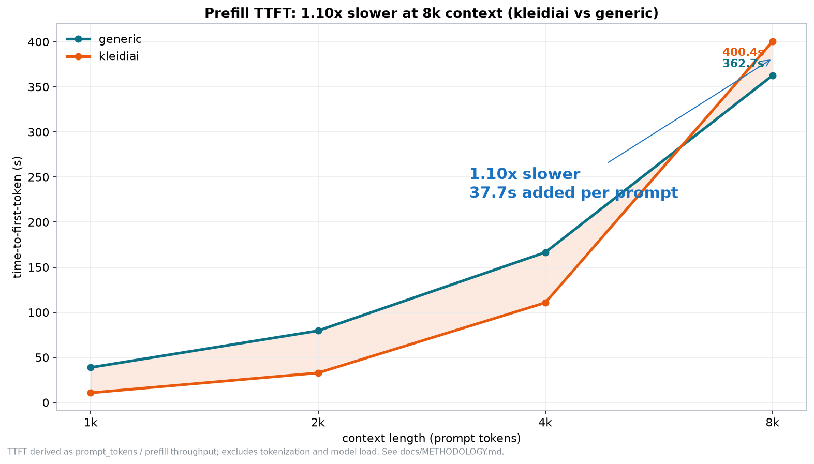
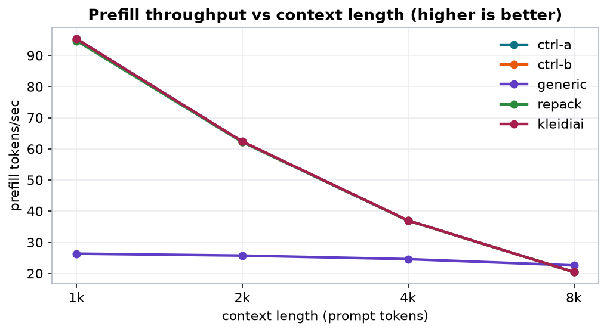
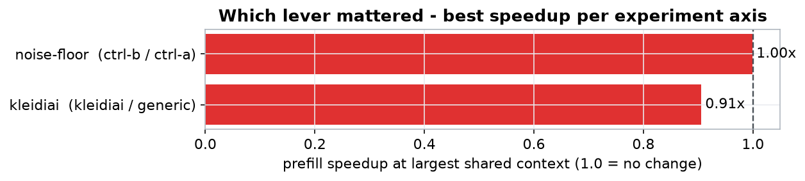
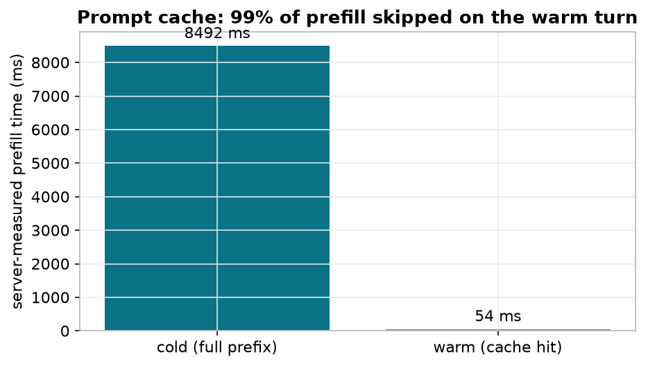
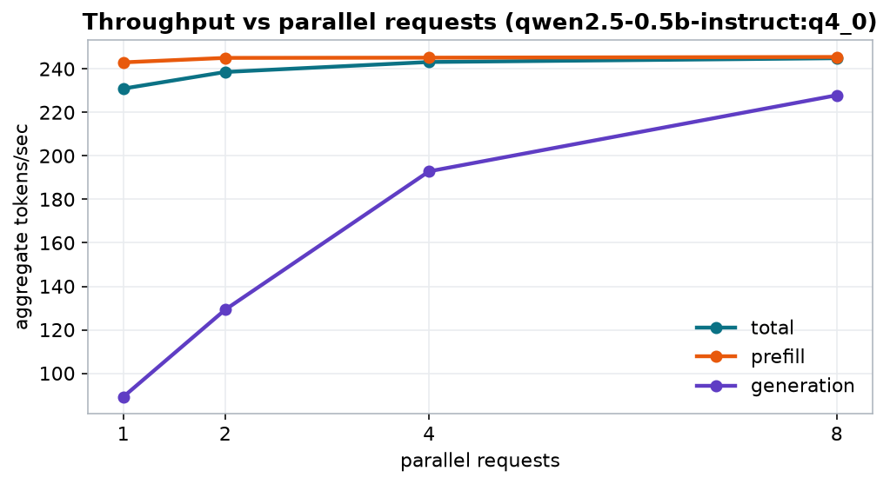

# Arm FirstFlight - Inference Optimization Report

## 1.10x SLOWER prefill at 8,192-token context (kleidiai vs generic), well outside the 0.3% noise floor

- TTFT 362.66s -> 400.37s at 8,192 tokens (kleidiai vs generic)
- prefill 23 -> 20 tok/s
- generation 19 -> 35 tok/s
- context-dependent: 3.62x at 1k -> 0.91x at 8k (the delta is a curve, not a number)
- measured noise floor (same build, twice): 0.3% - this delta is a REGRESSION well outside it
- measured prompt-cache TTFT: cold 8492ms -> warm 54ms (99% less prefill on the warm turn)

| 1.10x slower | 400.37s | 20 | $0.00 |
|---|---|---|---|
| prefill @ 8k vs generic | TTFT @ 8k (kleidiai) | prefill tok/s | $/M prompt tok (free runner) |

### Prefill TTFT: 1.10x slower at 8k context (kleidiai vs generic)

### Prefill throughput vs context length (higher is better)

### Which lever mattered

### Prompt cache: 99% of prefill skipped on the warm turn

### Throughput vs parallel requests (qwen2.5-0.5b-instruct:q4_0)

## Runs

| label | model:variant | threads | build | kleidiai | gen tok/s | peak mem | $/M prompt tok | $/M gen tok | quality |
|---|---|---:|---|---|---:|---:|---:|---:|---:|
| **noise-floor** |  |  |  |  |  |  |  |  |  |
| ctrl-a | qwen2.5-1.5b-instruct:q4_0 | 4 | b1 | yes | 35 | 1.3 GiB | $0.00 (free runner) | $0.00 (free runner) | ppl 37.42 |
| ctrl-b | qwen2.5-1.5b-instruct:q4_0 | 4 | b1 | yes | 35 | 1.3 GiB | $0.00 (free runner) | $0.00 (free runner) | ppl 37.42 |
| **kleidiai** |  |  |  |  |  |  |  |  |  |
| generic | qwen2.5-1.5b-instruct:q4_0 | 4 | b1 | no | 19 | 1.3 GiB | $0.00 (free runner) | $0.00 (free runner) | ppl 37.43 |
| repack | qwen2.5-1.5b-instruct:q4_0 | 4 | b1 | no | 36 | 1.3 GiB | $0.00 (free runner) | $0.00 (free runner) | ppl 37.42 |
| kleidiai | qwen2.5-1.5b-instruct:q4_0 | 4 | b1 | yes | 35 | 1.3 GiB | $0.00 (free runner) | $0.00 (free runner) | ppl 37.42 |

## Prefill scaling (TTFT seconds / prefill tok/s ± stddev)

_TTFT is derived as prompt_tokens ÷ prefill throughput; it excludes tokenization and model-load time. ± is the spread across repetitions._

| context | ctrl-a TTFT | ctrl-a tok/s | ctrl-b TTFT | ctrl-b tok/s | generic TTFT | generic tok/s | repack TTFT | repack tok/s | kleidiai TTFT | kleidiai tok/s |
|---|---:|---:|---:|---:|---:|---:|---:|---:|---:|---:|
| 1,024 | 10.74 | 95 ±0 | 10.77 | 95 ±0 | 38.86 | 26 ±0 | 10.81 | 95 ±0 | 10.74 | 95 ±0 |
| 2,048 | 32.87 | 62 ±0 | 32.84 | 62 ±0 | 79.57 | 26 ±0 | 32.94 | 62 ±0 | 32.83 | 62 ±0 |
| 4,096 | 110.73 | 37 ±0 | 110.74 | 37 ±0 | 166.51 | 25 ±0 | 110.83 | 37 ±0 | 110.68 | 37 ±0 |
| 8,192 | 400.40 | 20 ±0 | 400.67 | 20 ±0 | 362.66 | 23 ±0 | 400.74 | 20 ±0 | 400.37 | 20 ±0 |

## Measured TTFT - prompt cache, cold vs warm

_llama-server's own `timings` (includes tokenization). Cold = full shared prefix prefilled; warm = same prefix, new question, KV cache re-used (`cache_prompt` + `--cache-reuse`)._

| model:variant | cache-reuse | cold tokens | cold ms | warm tokens | warm ms | prefill saved |
|---|---:|---:|---:|---:|---:|---:|
| qwen2.5-0.5b-instruct:q4_0 | 256 | 1572 | 8492 | 10 | 54 | 99% |

## Throughput vs parallel requests (llama-batched-bench)

_Aggregate tokens/sec across all concurrent sequences._

**qwen2.5-0.5b-instruct:q4_0** - 1024 prompt + 32 gen tokens per request

| parallel | prefill tok/s | gen tok/s | total tok/s |
|---:|---:|---:|---:|
| 1 | 243.0 | 89.1 | 230.9 |
| 2 | 245.1 | 129.2 | 238.6 |
| 4 | 245.2 | 192.9 | 243.2 |
| 8 | 245.5 | 227.9 | 244.9 |

## Kernel evidence (from real runs, not build flags)

_Which CPU weight buffer each config actually loaded, per the load log._

- weight buffer - ctrl-a: CPU_KLEIDIAI 702.86 MiB, I8MM-tier kernels, ggml repack on
- weight buffer - ctrl-b: CPU_KLEIDIAI 702.86 MiB, I8MM-tier kernels, ggml repack on
- weight buffer - generic: CPU_Mapped 1011.16 MiB, NEON-tier kernels, ggml repack off
- weight buffer - repack: CPU_REPACK 885.41 MiB, I8MM-tier kernels, ggml repack on
- weight buffer - kleidiai: CPU_KLEIDIAI 702.86 MiB, I8MM-tier kernels, ggml repack on
- ggml system_info: `n_threads = 4 (n_threads_batch = 4) / 4 | CPU : NEON = 1 | ARM_FMA = 1 | FP16_VA = 1 | MATMUL_INT8 = 1 | SVE = 1 | DOTPROD = 1 | SVE_CNT = 16 | OPENMP = 1 | KLEIDIAI = 1 | REPACK = 1 |`
- cpuinfo Features: `fp asimd evtstrm aes pmull sha1 sha2 crc32 atomics fphp asimdhp cpuid asimdrdm jscvt fcma lrcpc dcpop sha3 sm3 sm4 asimddp sha512 sve asimdfhm uscat ilrcpc flagm sb paca pacg dcpodp sve2 sveaes svebitperm svesha3 svesm4 flagm2 frint svei8mm svebf16 i8mm bf16`

_Note: 3 run group(s) consolidated: generic: median of 2 rounds (spread = between-round), repack: median of 2 rounds (spread = between-round), kleidiai: median of 2 rounds (spread = between-round)._

_Run `firstflight experiment` to add the quality-delta column (proves the speedup did not degrade accuracy)._

Instance: github-arm-runner (GitHub-hosted Arm runner (ubuntu-24.04-arm)) | CPU: CPU | THP: madvise | firstflight 0.1.0 | generated 2026-08-14 03:19 UTC. Methodology: docs/METHODOLOGY.md