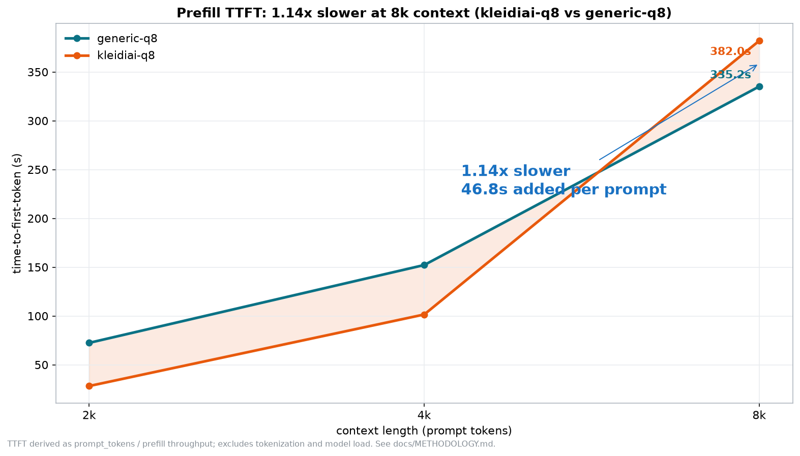
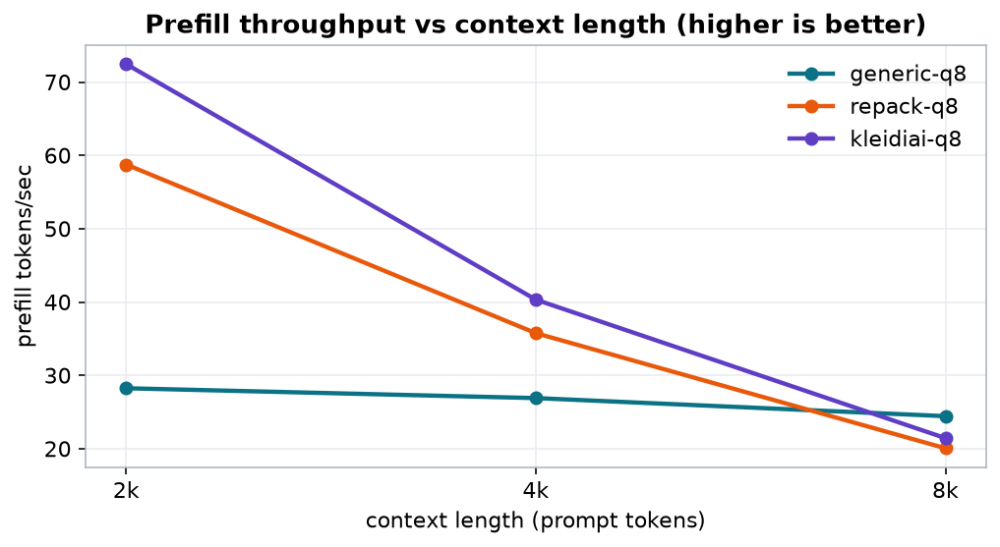
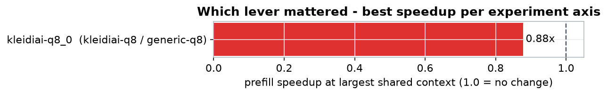

# Arm FirstFlight - Inference Optimization Report

## 2.56x faster prefill at 2k, inverting to 0.88x at 8k (kleidiai-q8 vs generic-q8): the advantage is context-dependent

- TTFT 335.19s -> 382.04s at 8,192 tokens (kleidiai-q8 vs generic-q8)
- prefill 24 -> 21 tok/s
- generation 18 -> 45 tok/s
- context-dependent: 2.56x at 2k -> 0.88x at 8k (the delta is a curve, not a number)

| 1.14x slower | 382.04s | 21 | $0.00 |
|---|---|---|---|
| prefill @ 8k vs generic-q8 | TTFT @ 8k (kleidiai-q8) | prefill tok/s | $/M prompt tok (free runner) |

### Prefill TTFT: 1.14x slower at 8k context (kleidiai-q8 vs generic-q8)

### Prefill throughput vs context length (higher is better)

### Which lever mattered

## Runs

| label | model:variant | threads | build | kleidiai | gen tok/s | peak mem | $/M prompt tok | $/M gen tok | quality |
|---|---|---:|---|---|---:|---:|---:|---:|---:|
| generic-q8 | qwen2.5-1.5b-instruct:q8_0 | 4 | b1 | no | 18 | 2.1 GiB | $0.00 (free runner) | $0.00 (free runner) | ppl 31.66 |
| repack-q8 | qwen2.5-1.5b-instruct:q8_0 | 4 | b1 | no | 39 | 2.1 GiB | $0.00 (free runner) | $0.00 (free runner) | ppl 31.63 |
| kleidiai-q8 | qwen2.5-1.5b-instruct:q8_0 | 4 | b1 | yes | 45 | 2.0 GiB | $0.00 (free runner) | $0.00 (free runner) | ppl 32.08 |

## Prefill scaling (TTFT seconds / prefill tok/s ± stddev)

_TTFT is derived as prompt_tokens ÷ prefill throughput; it excludes tokenization and model-load time. ± is the spread across repetitions._

| context | generic-q8 TTFT | generic-q8 tok/s | repack-q8 TTFT | repack-q8 tok/s | kleidiai-q8 TTFT | kleidiai-q8 tok/s |
|---|---:|---:|---:|---:|---:|---:|
| 2,048 | 72.50 | 28 ±0 | 34.85 | 59 ±0 | 28.27 | 72 ±0 |
| 4,096 | 152.24 | 27 ±0 | 114.54 | 36 ±0 | 101.56 | 40 ±0 |
| 8,192 | 335.19 | 24 ±0 | 408.37 | 20 ±0 | 382.04 | 21 ±0 |

## Kernel evidence (from real runs, not build flags)

_Which CPU weight buffer each config actually loaded, per the load log._

- weight buffer - generic-q8: CPU_Mapped 1801.09 MiB, NEON-tier kernels, ggml repack off
- weight buffer - repack-q8: CPU_REPACK 1564.07 MiB, I8MM-tier kernels, ggml repack on
- weight buffer - kleidiai-q8: CPU_KLEIDIAI 1564.07 MiB, I8MM-tier kernels, ggml repack off
- ggml system_info: `n_threads = 4 (n_threads_batch = 4) / 4 | CPU : NEON = 1 | ARM_FMA = 1 | FP16_VA = 1 | MATMUL_INT8 = 1 | SVE = 1 | DOTPROD = 1 | SVE_CNT = 16 | OPENMP = 1 | KLEIDIAI = 1 | REPACK = 1 |`
- cpuinfo Features: `fp asimd evtstrm aes pmull sha1 sha2 crc32 atomics fphp asimdhp cpuid asimdrdm jscvt fcma lrcpc dcpop sha3 sm3 sm4 asimddp sha512 sve asimdfhm uscat ilrcpc flagm sb paca pacg dcpodp sve2 sveaes svebitperm svesha3 svesm4 flagm2 frint svei8mm svebf16 i8mm bf16`

_Run `firstflight experiment` to add the quality-delta column (proves the speedup did not degrade accuracy)._

Instance: github-arm-runner (GitHub-hosted Arm runner (ubuntu-24.04-arm)) | CPU: CPU | THP: madvise | firstflight 0.1.0 | generated 2026-08-14 19:36 UTC. Methodology: docs/METHODOLOGY.md