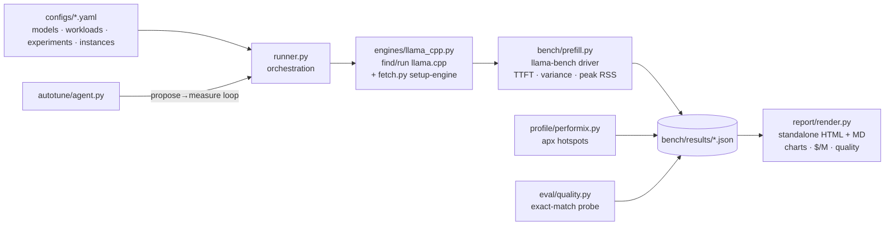

# The Explainer: every concept in this project, in plain language

Read this once and you can explain the whole project: what problem it addresses, what every
term means, how the code is put together, and why each decision was made. (How to *run* it
is in [RUNBOOK.md](RUNBOOK.md); how we *measure* is in [METHODOLOGY.md](METHODOLOGY.md).)

**How to read it:** §2 covers the basics; start there if words like "token" or
"quantization" are new, otherwise jump to §3. §8 is a one-line-per-term glossary
for quick lookup.

---

## 1. The project in one paragraph

Large language models are increasingly run on CPUs in the cloud, specifically Arm
CPUs (AWS Graviton, Google Axion, Microsoft Cobalt), because they are cheap and efficient.
The delay users feel is the wait before the first word appears, called
*time-to-first-token (TTFT)*, and it grows fast when the prompt is long (as in RAG and
agent apps that put documents into the context). This project is a harness that
measures that delay on Arm, applies seven Arm-specific optimizations
(KleidiAI kernels, the right quantization, CPU pinning, quantized KV-cache), verifies the
speedup with before/after numbers plus an accuracy check, and generates a
report anyone can reproduce with one click on a free Arm CI runner.

## 2. The absolute basics (start here if any term below is new)

**What is an LLM?** A large set of numbers, called weights, that takes some text and predicts
what text comes next. Repeat that prediction and you get an answer. The models used here have
between 0.5 and 1.5 billion weights.

**What is a token?** Models process text in chunks of roughly four characters, called tokens.
"optimization" is likely two of them. As a rule of thumb 1,000 tokens is about 750 words, so a
32,000-token prompt is roughly a 24,000-word document. Every speed number in this project is
tokens per second.

**Training vs inference.** Training produced the model: once, on a large GPU cluster, at great
expense. Inference is running that finished model to answer a prompt, which then happens
millions of times and is where the ongoing cost lives. This project only concerns inference.

**Why a CPU and not a GPU?** GPUs are faster but expensive and often supply-constrained, and
many production workloads don't need one. Small and mid-size models run acceptably on ordinary
cloud CPU servers, which are cheap and always available. Arm server CPUs give the best
performance per dollar in that category, which is why AWS, Google and Microsoft each designed
their own rather than buying someone else's.

**Compute-bound vs memory-bound.** A CPU does arithmetic far faster than it can fetch data from
memory, so any piece of work is limited by one or the other, and which one decides what will
speed it up:
- **Compute-bound**: the data is already in cache and the processor has a lot of arithmetic to
  do. Faster instructions and more cores help.
- **Memory-bound**: the processor sits idle waiting for weights to arrive from RAM. Adding cores
  achieves nothing; making the data smaller does.

This distinction determines which optimization applies where.

**Compiling and build flags.** llama.cpp ships as C++ source that you compile into an
executable. A build flag is an option given to the compiler that changes which code ends up in
that executable: same source, different machine code. The optimization at the centre of this
project is one flag, `-DGGML_CPU_KLEIDIAI=ON`.

**What is a benchmark, and why the protocol?** A timing experiment. The rules exist because a
shared cloud server is a noisy place to measure anything. Warm-up runs are discarded, because the
first run pays for cache misses and page faults the later ones don't. Measurements are repeated
(5 for the full prefill sweep, 3 for the experiment suite) and the spread is reported alongside
the value. Exactly one variable changes at a time, on the same machine, or you cannot say what
caused a difference.

**What is a cache?** Fast storage that avoids repeating slow work. Relevant here twice: the CPU's
own caches hold recently used data close to the cores, and the model keeps a **KV-cache** (§3) of
intermediate values for tokens it has already read, so producing each new word doesn't require
reprocessing the whole conversation.

**pip, venv, editable install.** `pip` installs Python packages. A **venv** is a project-private
environment so different projects' package versions don't conflict. `pip install -e .` installs
this repo into that environment in editable mode, so code changes take effect without
reinstalling.

**What is CI / GitHub Actions?** A service that runs commands on GitHub's machines automatically.
GitHub provides Arm-based machines free for public repositories, which is how anyone can
reproduce these benchmarks without owning Arm hardware.

**What is a profiler?** A tool that samples a running program and reports which functions consumed
the time. Arm's is called Performix.

## 3. The project's core concepts

### Inference, prefill, and generation
Running an LLM has two phases with different performance characteristics:

- **Prefill (prompt processing):** the model must process the entire prompt before it can emit
  anything. All prompt tokens are handled at once, as large matrix-matrix multiplications, so
  the processor is doing dense arithmetic. Prefill is **compute-bound**.
- **Generation (decode):** output then comes out one token at a time. Each step does
  comparatively little arithmetic but must read the weights from memory again, so generation is
  **memory-bound**.

**TTFT ≈ prompt_tokens ÷ prefill_speed**. The harness derives TTFT this way
(`bench/prefill.py:ttft_seconds`). At 520 tokens/sec, a 32,768-token prompt takes about 63
seconds before the first word appears; make prefill 1.5× faster and the same request starts
answering in about 42 seconds, with the same model on the same machine.

Doubling the prompt length more than doubles that cost: attention compares every token with
every earlier token, so the work grows with the square of the length. A single number at one
context length therefore says very little, which is why the harness sweeps 128 → 32k and reports
the curve.

### Why Arm / Neoverse
**Neoverse** is Arm's server-CPU family: Graviton2 = Neoverse-N1, Graviton3 = V1,
Graviton4 = V2, Graviton5 = V3; Azure Cobalt 100 = N2, Google Axion = V2 (C4A) / N3 (N4A).
Cloud vendors adopted them for price and efficiency, so a growing share of LLM serving happens there.
Arm cores include instructions that do many arithmetic operations at once instead of one at a
time: **DOTPROD**, **i8mm** (int8 matrix-multiply), **BF16**, and the **SVE/SVE2** vector
extensions. Ordinary compiled code often doesn't use them; optimized kernels do. The
opportunity this project targets is getting kernels that use them.
(**SME/SME2**, Arm's newer matrix extension, exists only in client silicon today: phones and
Apple Macs. No shipping Neoverse server core implements it, so it is out of scope here;
verified against Arm's own SME2 device list and AWS's Graviton feature table, 2026-08-09.)

### llama.cpp, GGUF, and the tools
- **llama.cpp**: the standard open-source C++ engine for running LLMs on CPUs. We drive it,
  never fork it.
- **GGUF**: its model file format (all the weights plus metadata in one file you download).
- **llama-cli**: its generate-text binary (our smoke test and quality probe use it).
- **llama-bench**: its built-in benchmarker. Give it `-p` (prefill sizes) and `-n`
  (generation sizes) and it outputs timing rows; `-o json` makes them machine-readable.
  We parse `avg_ts` (mean tokens/sec) and `stddev_ts` (spread across repeats) from it.

### Quantization (the Q4_0 / Q4_K_M / Q8_0 zoo)
Model weights are stored as 16-bit numbers. **Quantization** stores them in fewer bits, the way
writing 3.14 instead of 3.14159265 keeps most of the value in less space. A 1.5B-parameter model
is about 3 GB at 16 bits and under 1 GB at 4 bits. Fewer bits means less RAM, less memory traffic,
and faster arithmetic, in exchange for a small rounding error in the weights:
- **Q8_0**: 8 bits/weight. Nearly lossless, biggest of the three.
- **Q4_0**: 4 bits/weight, simple blocks. Small and fast, slightly lossier.
- **Q4_K_M**: 4-bit "k-quant" with smarter packing. Usually better accuracy than Q4_0, and the
  default most people pick.

The catch behind our headline result: Arm's KleidiAI kernels accelerate only Q4_0 and
Q8_0, not Q4_K_M. Picking the common default quant therefore opts you out of Arm
acceleration. Choosing Q4_0 to match the silicon is optimization #2, and the quant-sweep
experiment plus the quality probe measure what that choice costs and buys.

### KleidiAI (optimization #1, the headline)
**KleidiAI** is Arm's library of hand-tuned matrix **microkernels**: small routines written
by Arm's engineers to run one operation (matrix multiply) as fast as the silicon
allows. It picks the best available kernel at runtime, preferring SME2 → i8mm → dotprod; on a
Neoverse server the SME2 tier never fires (no server core has SME), so the win comes from the
i8mm/dotprod kernels. llama.cpp integrates it behind the build flag
`-DGGML_CPU_KLEIDIAI=ON`. At model load it repacks Q4_0/Q8_0 weights once into a
layout its kernels can read efficiently, then routes the matrix multiplications through the fast
paths. The model file and commands are unchanged; only the machine code differs. Because it is a build-time flag, our before/after
compares llama.cpp builds (the CI job compiles the full ladder: a generic armv8-a floor,
the native default with ggml's own aarch64 repack kernels, and the KleidiAI build). Compiling
with the flag does not guarantee the kernels ran, so the harness checks activation:
when KleidiAI is live, the load log prints `load_tensors: CPU_KLEIDIAI model buffer size…`.
We grep for that line (`detect_kleidiai`) and print yes/no in the report's `kleidiai` column.

### Thread pinning (optimization #3)
More threads stop helping once memory bandwidth is the limit, and the OS scheduler moves threads
between cores, which leaves each thread on a core whose cache no longer holds its data.
`llama-bench -C 0x0f --cpu-strict 1`
**pins** threads to fixed cores (the hex mask picks which). The thread-sweep and pinning
experiments measure both effects.

### KV-cache, and quantizing it (optimization #4)
During generation the model keeps a **KV-cache**: stored "keys" and "values" for every token
seen so far, so each new word doesn't recompute the past. At long context that store becomes
large, and moving it competes for the same memory bandwidth as the weights.
`llama-bench -ctk q8_0 -ctv q8_0` stores it at 8 bits instead of 16, halving its footprint and
traffic, which relieves the memory-bandwidth pressure Neoverse hits at long context. The kv-cache experiment measures f16 vs q8_0, with the quality probe watching
for accuracy cost.

### Prefix caching, and measured vs derived TTFT
The KV-cache enables one more optimization: when two requests share a long **prefix** (the same
system prompt, or the same retrieved document), the server can keep that portion of the cache and
process only the part that differs. That is **prompt/prefix caching**. llama-server does it by default
(`cache_prompt`), and `--cache-reuse` extends it to near-matches. For agent/RAG serving this
is the largest TTFT lever available: the first ("cold") turn pays full prefill; every
following ("warm") turn processes only the new question. `firstflight ttft` demonstrates it,
and unlike the benchmark's derived TTFT (prompt ÷ speed), it reports the server's own
measured `prompt_ms` timing, cold vs warm, side by side.

### Arm Performix (the profiler)
**Performix** is Arm's performance-analysis tool for Neoverse servers; its CLI is **`apx`**.
It samples where CPU time goes ("**hotspots**": the functions that consume the cycles).
Our wrapper runs its `code_hotspots` recipe against a prefill run and surfaces the top
functions into the report. That grounds the optimization in an attribution rather than a guess:
the profile shows the matmul kernel dominates, and KleidiAI replaces that kernel. On
non-Arm machines it skips without error.

### The quality guardrail
A speedup that breaks the model is worthless, and quantization can degrade answers. After
every experiment config we run a small **exact-match probe** (fixed Q&A through llama-cli:
"What is 5 multiplied by 6?" must contain "30" as a whole word) and print accuracy next to the speed. It is
a coarse regression check, not a benchmark of model quality; the report shows correct/total per config ("32/40 → 32/40").

### Cost per million tokens
The cost translation: `$/M tokens = hourly_price ÷ (tokens_per_sec × 3600) × 1e6`.
Faster tokens on the same rented machine mean cheaper tokens; nothing else changes. We use
real, dated prices (e.g. c8g.2xlarge $0.319/hr, us-east-1) so the report ends in
dollars as well as milliseconds.

### The agentic autotuner (stretch)
`firstflight autotune --enable` closes the loop automatically: propose a config → benchmark
it → keep the best → stop when nothing improves. The default proposer is a deterministic
grid (no API key needed); `--llm` swaps in Claude, which reads the Performix hotspots and
trial history and proposes the next config as JSON (falling back to the grid on invalid output).

## 4. How the code is put together

Design rules that shaped the code:
- **Skip, don't crash**: on a machine without llama.cpp or off Arm, every command skips
  with a clear message instead of crashing (which is why it also runs on a Windows laptop).
- **Verify, don't invent**: every external fact (flags, URLs, prices, runner labels) was
  checked against a live source, dated in [CONFIRM_ON_ARM.md](CONFIRM_ON_ARM.md); unknowns
  that can only be confirmed on the box are marked `TODO(confirm)` instead of guessed.
- **Results are self-describing JSON** so a committed result is interpretable years later.
- **Labeling is enforced in code**: synthetic data carries a `[SYNTHETIC]` tag and the report
  auto-shows a DEMO banner whenever it renders any.

## 5. What was done, in order

1. **Scaffold + smoke**: installable package, configs, and a tiny-model smoke test that proves
   the pipeline on any machine.
2. **Benchmark core**: llama-bench driver, context sweep, derived TTFT, variance, peak RSS.
3. **Report**: the one-page standalone HTML report plus its markdown twin.
4. **Performix**: `apx` wrapper (real CLI flow sourced from Arm's own MCP server) feeding
   hotspots into the report.
5. **Experiments + quality**: the optimization axes as declarative configs, run
   back-to-back on the same machine, each with the quality probe.
6. **Autotuner**: the optional propose→measure loop.
7. **Hardening**: a multi-agent audit found and fixed 4 latent bugs (peak-RSS
   attribution, quality false-positives, a regex bug, console markup eating `[report]`);
   then `setup-engine` (prebuilt llama.cpp auto-download, verified against the real binary,
   which also exposed and fixed a real stdin hang), KleidiAI-active detection, real dated
   prices, the KV-cache axis, and a CI job that runs the full before/after comparison on a
   free Arm runner and prints the report into the run summary.
8. **Staged commit history**: the project was committed in dependency order, each stage
   installable and passing its own tests, so the build can be read one layer at a time.

## 6. What's real vs pending

- **Real:** all code paths, 90+ passing tests, verified flags/URLs/prices, the engine
  download, the report pipeline.
- **Synthetic (clearly labeled):** the sample report's performance numbers. They exist so
  the repo demonstrates its output before hardware runs.
- **Pending (one click, needs your GitHub account):** dispatch the `arm-bench` →
  `kleidiai-before-after` workflow; it produces the real before/after evidence to commit
  over the sample.

## 7. Questions a judge might ask (and the answers)

- *"Why focus on prefill instead of tokens/sec?"* Generation speed is what benchmarks
  usually quote, but agent/RAG users wait on prefill (TTFT) because their prompts are
  large. It is also the phase Arm's matrix instructions accelerate most (compute-bound).
- *"Isn't this just llama.cpp's own benchmark?"* llama-bench measures one config once. The
  contribution is the controlled before/after harness on top: fixed instance/model,
  KleidiAI-activation proof, quality guardrail, cost translation, profiler attribution, and
  one-click reproducibility. Those are the parts that turn a timing into evidence.
- *"Why is Q4_K_M slower than Q4_0 here? Isn't K-quant better?"* K-quants have better
  accuracy per bit, but KleidiAI does not accelerate them, so on Neoverse Q4_K_M runs on generic
  kernels while Q4_0 gets the i8mm/dotprod path. The quant-sweep and quality probe quantify
  that trade and its accuracy cost.
- *"How do I know KleidiAI actually kicked in?"* The `kleidiai` column: the harness greps
  the load log for the `CPU_KLEIDIAI` buffer marker at runtime. If the marker is absent, the
  report says no.
- *"What here do I reuse in my own project?"* The harness itself, the three-build CI recipe,
  the `apx` wrapper, the Q4_0-only gotcha, and the methodology; see the README's
  "Reusable beyond this repo".

## 8. Glossary: one line per term

| Term | Meaning |
|---|---|
| **Token** | A chunk of text a model processes, about four characters; 1,000 tokens ≈ 750 words |
| **LLM** | Large language model: billions of weights predicting the next token |
| **Inference** | Running a trained model (vs training = creating it) |
| **Prefill** | Reading the whole prompt before answering; parallel, compute-bound |
| **Generation / decode** | Producing output one token at a time; memory-bandwidth-bound |
| **TTFT** | Time-to-first-token: the delay before the first output token ≈ prompt ÷ prefill speed |
| **Context length** | How many tokens of prompt/history the model is fed |
| **tokens/sec (tok/s)** | The universal speed unit here; `avg_ts` in llama-bench output |
| **Compute-bound** | Limited by how fast the CPU can do arithmetic |
| **Memory-bandwidth-bound** | Limited by how fast data arrives from RAM |
| **llama.cpp** | The standard C++ engine for LLM inference on CPUs |
| **GGUF** | llama.cpp's single-file model format |
| **llama-bench / llama-cli** | llama.cpp's benchmarker / text-generation binary |
| **Quantization** | Storing weights in fewer bits (3.14159 → 3.14): smaller, faster, small error |
| **Q4_0 / Q8_0** | Simple 4-bit / 8-bit quant formats; the ones KleidiAI accelerates |
| **Q4_K_M** | Smarter 4-bit "k-quant"; common default; not KleidiAI-accelerated |
| **KV-cache** | Stored intermediate values for tokens already read, reused each generation step |
| **Prefix/prompt caching** | Reusing the KV-cache for a shared prompt prefix, so warm turns skip almost all prefill (`cache_prompt`, `--cache-reuse`) |
| **llama-server** | llama.cpp's HTTP server; its `/completion` response includes measured `timings` (our measured TTFT) |
| **-ctk / -ctv** | llama-bench flags setting the KV-cache storage type (f16 → q8_0 halves it) |
| **KleidiAI** | Arm's hand-tuned matmul microkernels; enabled by `-DGGML_CPU_KLEIDIAI=ON` |
| **Microkernel** | A tiny routine hand-written to do one operation optimally on one chip |
| **DOTPROD / i8mm / SVE2** | Arm vector and matrix instructions available on Neoverse servers |
| **SME2** | Arm's newer matrix extension. Client silicon only (phones, Apple Macs); not on any Neoverse server core as of 2026-08 |
| **Neoverse** | Arm's server-CPU family (Graviton2=N1, Graviton3=V1, Graviton4=V2) |
| **Graviton / Axion / Cobalt** | AWS / Google / Microsoft's Arm server chips |
| **Thread pinning / affinity** | Fixing threads to specific cores (`-C mask --cpu-strict`) |
| **Warm-up run** | Discarded first run that pays for cache misses and page faults |
| **stddev / variance** | The spread across repeats, reported alongside each mean |
| **Peak RSS** | Maximum RAM the benchmark process used |
| **Performix / apx** | Arm's Neoverse profiler and its CLI |
| **Hotspot** | A function where the profiler says the CPU time goes |
| **Build flag** | A compile-time option: same source, different machine code |
| **CI / GitHub Actions** | GitHub-hosted machines that run checks/benchmarks on every change |
| **Arm runner** | GitHub's free-for-public-repos Arm machine (`ubuntu-24.04-arm`) |
| **Artifact (CI)** | Files a CI run saves for download (our HTML report + JSONs) |
| **venv / pip / editable install** | Project-private environment / package installer / install that picks up code edits |
| **Smoke test** | Minimal end-to-end run proving the pipeline works at all |
| **$/M tokens** | Dollars per million tokens: `price/hr ÷ (tok/s × 3600) × 1e6` |
| **Synthetic data** | Clearly-labeled illustrative numbers (DEMO banner), not measurements |
