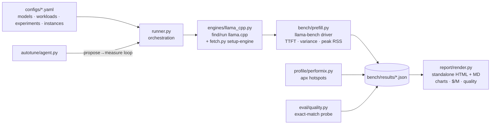

# The Explainer — every concept in this project, in plain language

Read this once and you can explain the whole project: what problem it attacks, what every
term means, how the code is put together, and why each decision was made. (How to *run* it
is in [RUNBOOK.md](RUNBOOK.md); how we *measure* is in [METHODOLOGY.md](METHODOLOGY.md).)

**How to read it:** §2 is the absolute basics — start there if words like "token" or
"quantization" are new. Already comfortable? Jump to §3. §8 is a one-line-per-term glossary
for quick lookup mid-conversation.

---

## 1. The story in one paragraph

Large language models are increasingly run on **CPUs in the cloud** — specifically **Arm**
CPUs (AWS Graviton, Google Axion, Microsoft Cobalt), because they're cheap and efficient.
The pain point users actually feel is the **wait before the first word appears** —
*time-to-first-token (TTFT)* — and it gets brutal when the prompt is long (as in RAG and
agent apps that stuff documents into the context). This project is a harness that
**measures** that pain precisely on Arm, **applies seven Arm-specific optimizations**
(KleidiAI kernels, the right quantization, CPU pinning, quantized KV-cache), **proves** the
speedup with rigorous before/after numbers plus an accuracy check, and **auto-generates a
report** anyone can reproduce with one click on a free Arm CI runner.

## 2. The absolute basics (start here if any term below is new)

**What is an LLM?** A large language model (like the ones behind ChatGPT or Claude) is a
giant grid of numbers — billions of "weights" — that, given some text, predicts what text
should come next. That's all it does, extremely well.

**What is a token?** Models don't read letters or whole words; they read **tokens** — text
chopped into LEGO-brick pieces, roughly ¾ of a word each ("optimization" might be
`optim`+`ization`). "32,000 tokens of context" ≈ a 24,000-word document. Every speed number
in this project is *tokens per second*.

**Training vs inference.** Training is *writing* the cookbook (done once, on thousands of
GPUs, costs millions). **Inference is cooking from it** — running the finished model to
answer a prompt. This project is entirely about inference.

**Why run inference on a CPU — aren't GPUs the thing?** GPUs are fastest, but they're
expensive, scarce, and overkill for many jobs. A plain cloud CPU server is cheap, always
available, and plenty for small/medium models — *if* you tune it. Arm CPUs (what this
project targets) are the cheapest watts in the cloud, which is why AWS, Google, and
Microsoft all built their own Arm chips.

**Cores, threads, and the kitchen analogy.** A CPU has several **cores** (independent
workers). A program runs **threads** (tasks) across them. Picture a restaurant kitchen:
cores are cooks, threads are jobs assigned to cooks. Two things limit the kitchen:
- **Compute-bound**: the cooks' hands are the bottleneck — more/faster cooks help.
- **Memory-bandwidth-bound**: the cooks are fast but the *waiters can't bring ingredients
  from the pantry fast enough* — adding cooks changes nothing; shrinking the ingredients
  (so more fits per trip) is what helps.

Keep that pair in mind — it explains nearly every optimization here.

**What does "compiling" and a "build flag" mean?** llama.cpp is C++ source code; you
**compile** ("build") it into an executable program. A **build flag** is an option you pick
at compile time — like ordering the same car model with or without the turbo. Same source,
different engine inside. Our headline optimization is literally one build flag
(`-DGGML_CPU_KLEIDIAI=ON`).

**What is a benchmark, and why the ritual?** A benchmark is a stopwatch experiment. The
rules exist because computers are noisy: **warm-up runs** are discarded (first lap on cold
tires doesn't count), we **repeat several times** (default 5 for the full prefill sweep,
3 for the experiment suite) and report the spread (one lucky run proves
nothing), and we **change exactly one thing at a time** on the **same machine** (otherwise
you don't know what caused the difference).

**What is a cache?** A small fast scratchpad that saves you re-doing slow work. Your browser
caches images; the model caches its reading of the conversation so far (the *KV-cache*,
§3) — like sticky notes summarizing every page you've read, so writing the next word never
requires re-reading the whole book.

**What are pip, a venv, and an "editable install"?** `pip` installs Python packages. A
**venv** (virtual environment) is a clean, project-private toolbox so different projects'
package versions don't clash. `pip install -e .` installs *this* repo into the venv in
"editable" mode — code changes take effect without reinstalling.

**What is CI / GitHub Actions?** A robot computer that runs your checks automatically on
every change. GitHub offers hosted runner machines — including **free Arm machines** for
public repos, which is how judges can reproduce our benchmarks with one click, no hardware.

**What is a profiler?** A stopwatch-with-clipboard that watches a running program and
reports *where the time actually went*, function by function. Ours is Arm's **Performix**.

## 3. The project's core concepts

### Inference, prefill, and generation
Running an LLM has two phases with totally different characters:

- **Prefill (prompt processing):** the model reads your entire prompt *before it can say
  anything*. All prompt tokens can be processed in parallel — big matrix-matrix multiplies —
  so prefill is **compute-bound** (the cooks' hands are the limit).
- **Generation (decode):** the model then produces output one token at a time. Each step
  reuses cached state and does thinner matrix-vector work — generation is mostly
  **memory-bandwidth-bound** (the waiters are the limit).

**TTFT ≈ prompt_tokens ÷ prefill_speed.** That's the derivation the whole harness pivots on
(`bench/prefill.py:ttft_seconds`). A 32,768-token prompt at 520 tokens/sec of prefill ≈
**63 seconds of silence** before the first word. Speed up prefill 1.54× (the demo headline)
and the silence drops to ≈41 s. That's why we sweep context lengths (128 → 32k) — to make the scaling curve, not
just one number, visible. (Why do long prompts hurt *worse than linearly*? Attention — the
mechanism where every token looks at every earlier token — grows with the square of length.)

### Why Arm / Neoverse
**Neoverse** is Arm's server-CPU family: Graviton2 = Neoverse-N1, Graviton3 = V1,
Graviton4 = V2. Cloud vendors love them for price/efficiency, so a growing slice of LLM
serving happens there. Arm cores carry special matrix instructions — **DOTPROD**, **i8mm**
(int8 matrix-multiply), and newer **SME/SME2** — think of them as a built-in food processor
that generic code never switches on. Switching them on is the whole opportunity here.

### llama.cpp, GGUF, and the tools
- **llama.cpp** — the standard open-source C++ engine for running LLMs on CPUs. We drive it,
  never fork it.
- **GGUF** — its model file format (all the weights + metadata in one file you download).
- **llama-cli** — its generate-text binary (our smoke test and quality probe use it).
- **llama-bench** — its built-in benchmarker: give it `-p` (prefill sizes) and `-n`
  (generation sizes) and it outputs timing rows; `-o json` makes them machine-readable.
  We parse `avg_ts` (mean tokens/sec) and `stddev_ts` (spread across repeats) from it.

### Quantization (the Q4_0 / Q4_K_M / Q8_0 zoo)
Model weights are natively 16-bit numbers. **Quantization** stores them with fewer bits —
like writing 3.14159265 as 3.14: the notebook gets much smaller, reading it gets faster,
and you accept a tiny rounding error. Fewer bits = less RAM, less memory traffic (smaller
ingredients per waiter trip!), faster math:
- **Q8_0**: 8 bits/weight. Nearly lossless, biggest of the three.
- **Q4_0**: 4 bits/weight, simple blocks. Small and fast, slightly lossier.
- **Q4_K_M**: 4-bit "k-quant" — cleverer packing, usually better accuracy than Q4_0, and the
  default most people pick.

**The catch that powers our headline:** Arm's KleidiAI kernels accelerate **only Q4_0 and
Q8_0** — *not* Q4_K_M. So the "sensible default" quant silently opts you out of Arm
acceleration. Choosing Q4_0 *because of the silicon* is optimization #2, and the quant-sweep
experiment + quality probe prove what that choice costs and buys.

### KleidiAI (optimization #1, the headline)
**KleidiAI** is Arm's library of hand-tuned matrix **microkernels** — tiny routines written
by Arm's engineers to do one operation (matrix multiply) as fast as this exact silicon
allows, using DOTPROD/i8mm/SME2. llama.cpp integrates it behind the build flag
`-DGGML_CPU_KLEIDIAI=ON`. At model load it **repacks** Q4_0/Q8_0 weights once into a
cache-friendly layout (reorganizing the pantry so every trip grabs exactly what the recipe
needs), then routes matmuls through the fast paths. Same model file, same commands —
different machine code underneath. Because it's a *build-time* flag, our before/after
compares **two llama.cpp builds** (the CI job compiles both — plus a third `-mcpu=native`
build for the build-flags axis). And because "we
compiled with the flag" ≠ "the kernels actually ran", the harness **proves activation**:
when KleidiAI is live, the load log prints `load_tensors: CPU_KLEIDIAI model buffer size…` —
we grep for it (`detect_kleidiai`) and print yes/no in the report's `kleidiai` column.

### Thread pinning (optimization #3)
More threads ≠ more speed forever (the waiters saturate), and the OS scheduler bounces
threads between cores, trashing each core's warmed-up cache — like cooks forced to swap
stations mid-recipe, re-fetching all their tools. `llama-bench -C 0x0f --cpu-strict 1`
**pins** threads to fixed cores (the hex mask picks which). The thread-sweep and pinning
experiments measure both effects.

### KV-cache, and quantizing it (optimization #4)
During generation the model keeps a **KV-cache** — the sticky notes: stored "keys/values"
for every token seen so far, so each new word doesn't recompute the past. At long context
the sticky-note pile gets *huge*, and moving it competes for the same memory bandwidth as
the weights. `llama-bench -ctk q8_0 -ctv q8_0` writes the notes in 8-bit shorthand instead
of 16-bit — **half the footprint and traffic** — exactly the pressure point on Neoverse at
long context. The kv-cache experiment measures f16 vs q8_0, with the quality probe watching
for accuracy cost.

### Prefix caching, and measured vs derived TTFT
The sticky notes unlock one more trick: if two requests share a long **prefix** (the same
system prompt or RAG context), the server can keep the prefix's notes and only read the part
that changed. That's **prompt/prefix caching** — llama-server does it by default
(`cache_prompt`), and `--cache-reuse` extends it to near-matches. For agent/RAG serving this
is the biggest honest TTFT lever there is: the first ("cold") turn pays full prefill; every
following ("warm") turn processes only the new question. `firstflight ttft` demonstrates it —
and unlike the benchmark's *derived* TTFT (prompt ÷ speed), it reports the server's **own
measured** `prompt_ms` stopwatch, cold vs warm, side by side.

### Arm Performix (the profiler)
**Performix** is Arm's performance-analysis tool for Neoverse servers; its CLI is **`apx`**.
It samples where CPU time actually goes ("**hotspots**" — which functions burn the cycles).
Our wrapper runs its `code_hotspots` recipe against a prefill run and surfaces the top
functions into the report — so the optimization isn't a guess ("the matmul kernel dominates;
KleidiAI replaces exactly that kernel") but an attribution. Off Arm it politely does nothing.

### The quality guardrail
A speedup that breaks the model is worthless, and quantization *can* degrade answers. After
every experiment config we run a small **exact-match probe** (fixed Q&A through llama-cli —
"What is 5 multiplied by 6?" must contain "30" as a whole word) and print accuracy next to the speed. It's
a smoke alarm, not a leaderboard — the report shows correct/total per config ("32/40 → 32/40").

### Cost per million tokens
The business translation: `$/M tokens = hourly_price ÷ (tokens_per_sec × 3600) × 1e6`.
Faster tokens on the same rented machine = cheaper tokens; nothing else changes. We use
**real, dated prices** (e.g. c8g.2xlarge $0.319/hr, us-east-1) so the report ends in
dollars, not just milliseconds.

### The agentic autotuner (stretch)
`firstflight autotune --enable` closes the loop automatically: propose a config → benchmark
it → keep the best → stop when nothing improves. The default proposer is a deterministic
grid (no API key needed); `--llm` swaps in Claude, which reads the Performix hotspots and
trial history and proposes the next config as JSON (falling back to the grid if it misbehaves).

## 4. How the code is put together

Design rules that shaped everything:
- **Degrade gracefully**: on a machine without llama.cpp or off Arm, every command skips
  with a clear message instead of crashing (that's why it runs on your Windows laptop).
- **Verify, don't invent**: every external fact (flags, URLs, prices, runner labels) was
  checked against a live source, dated in [CONFIRM_ON_ARM.md](CONFIRM_ON_ARM.md); genuinely
  box-only unknowns are marked `TODO(confirm)` instead of guessed.
- **Results are self-describing JSON** so a committed result is interpretable years later.
- **Honesty is enforced in code**: synthetic data carries a `[SYNTHETIC]` tag and the report
  auto-shows a DEMO banner whenever it renders any.

## 5. What was actually done, in order

1. **Scaffold + smoke** — installable package, configs, tiny-model smoke test that proves
   the pipeline anywhere.
2. **Benchmark core** — llama-bench driver, context sweep, derived TTFT, variance, peak RSS.
3. **Report** — the one-page standalone HTML (the "WOW" artifact) + markdown twin.
4. **Performix** — `apx` wrapper (real CLI flow sourced from Arm's own MCP server) feeding
   hotspots into the report.
5. **Experiments + quality** — the optimization axes as declarative configs, run
   back-to-back on the same machine, each with the quality probe.
6. **Autotuner** — the optional propose→measure loop.
7. **Hardening & winnability** — a multi-agent audit found and fixed 4 latent bugs (peak-RSS
   attribution, quality false-positives, a regex bug, console markup eating `[report]`);
   then: `setup-engine` (prebuilt llama.cpp auto-download, verified against the real binary —
   which also exposed and fixed a real stdin hang), KleidiAI-active detection, real dated
   prices, the KV-cache axis, and a CI job that runs the *entire* before/after story on a
   free Arm runner and prints the report into the run summary.
8. **`versions/` v1→v7** — the same final code sliced into seven cumulative, independently
   runnable stages so the build can be reviewed one layer at a time.

## 6. What's real vs pending

- **Real:** all code paths, 90+ passing tests, verified flags/URLs/prices, the engine
  download, the report pipeline.
- **Synthetic (clearly labeled):** the sample report's performance numbers — they exist so
  the repo demonstrates its output before hardware runs.
- **Pending (one click, needs your GitHub account):** dispatch the `arm-bench` →
  `kleidiai-before-after` workflow; it produces the real before/after evidence to commit
  over the sample.

## 7. Questions a judge might ask (and the answers)

- *"Why focus on prefill instead of tokens/sec?"* — Generation speed is what benchmarks
  usually quote, but agent/RAG users wait on **prefill** (TTFT) because their prompts are
  huge. It's also the phase Arm's matrix instructions accelerate most (compute-bound).
- *"Isn't this just llama.cpp's own benchmark?"* — llama-bench measures one config once. The
  contribution is the controlled **before/after harness on top**: fixed instance/model,
  KleidiAI-activation proof, quality guardrail, cost translation, profiler attribution, and
  one-click reproducibility — the parts that turn a timing into evidence.
- *"Why is Q4_K_M slower than Q4_0 here? Isn't K-quant better?"* — Better accuracy per bit,
  yes — but KleidiAI doesn't accelerate k-quants, so on Neoverse Q4_K_M runs on generic
  kernels while Q4_0 gets the i8mm/SME2 path. That trade (and its accuracy cost) is exactly
  what the quant-sweep + quality probe quantify.
- *"How do I know KleidiAI actually kicked in?"* — The `kleidiai` column: the harness greps
  the load log for the `CPU_KLEIDIAI` buffer marker at runtime. No marker, no claim.
- *"What here do I reuse in my own project?"* — The harness itself, the three-build CI recipe,
  the `apx` wrapper, the Q4_0-only gotcha, and the methodology — see the README's
  "Reusable beyond this repo".

## 8. Glossary — one line per term

| Term | Meaning |
|---|---|
| **Token** | The LEGO brick of text a model reads/writes; ≈ ¾ of a word |
| **LLM** | Large language model — billions of weights predicting the next token |
| **Inference** | Running a trained model (vs training = creating it) |
| **Prefill** | Reading the whole prompt before answering; parallel, compute-bound |
| **Generation / decode** | Producing output one token at a time; memory-bandwidth-bound |
| **TTFT** | Time-to-first-token: the silence before the first word ≈ prompt ÷ prefill speed |
| **Context length** | How many tokens of prompt/history the model is fed |
| **tokens/sec (tok/s)** | The universal speed unit here; `avg_ts` in llama-bench output |
| **Compute-bound** | Limited by CPU math speed (the cooks) |
| **Memory-bandwidth-bound** | Limited by RAM traffic (the waiters) |
| **llama.cpp** | The standard C++ engine for LLM inference on CPUs |
| **GGUF** | llama.cpp's single-file model format |
| **llama-bench / llama-cli** | llama.cpp's benchmarker / text-generation binary |
| **Quantization** | Storing weights in fewer bits (3.14159 → 3.14): smaller, faster, tiny error |
| **Q4_0 / Q8_0** | Simple 4-bit / 8-bit quant formats — the ones KleidiAI accelerates |
| **Q4_K_M** | Smarter 4-bit "k-quant"; common default; **not** KleidiAI-accelerated |
| **KV-cache** | Sticky notes of everything read so far, reused every generation step |
| **Prefix/prompt caching** | Re-using the sticky notes for a shared prompt prefix — warm turns skip almost all prefill (`cache_prompt`, `--cache-reuse`) |
| **llama-server** | llama.cpp's HTTP server; its `/completion` response includes measured `timings` (our measured TTFT) |
| **-ctk / -ctv** | llama-bench flags setting the KV-cache storage type (f16 → q8_0 halves it) |
| **KleidiAI** | Arm's hand-tuned matmul microkernels; enabled by `-DGGML_CPU_KLEIDIAI=ON` |
| **Microkernel** | A tiny routine hand-written to do one operation optimally on one chip |
| **DOTPROD / i8mm / SME2** | Arm matrix instructions — the built-in food processor |
| **Neoverse** | Arm's server-CPU family (Graviton2=N1, Graviton3=V1, Graviton4=V2) |
| **Graviton / Axion / Cobalt** | AWS / Google / Microsoft's Arm server chips |
| **Thread pinning / affinity** | Fixing threads to specific cores (`-C mask --cpu-strict`) |
| **Warm-up run** | Discarded first lap on cold tires |
| **stddev / variance** | The spread across repeats — honesty about noise |
| **Peak RSS** | Maximum RAM the benchmark process actually used |
| **Performix / apx** | Arm's Neoverse profiler and its CLI |
| **Hotspot** | A function where the profiler says the CPU time actually goes |
| **Build flag** | A compile-time option — same source, different engine inside |
| **CI / GitHub Actions** | Robot machines that run checks/benchmarks on every change |
| **Arm runner** | GitHub's free-for-public-repos Arm machine (`ubuntu-24.04-arm`) |
| **Artifact (CI)** | Files a CI run saves for download (our HTML report + JSONs) |
| **venv / pip / editable install** | Project-private toolbox / installer / live-linked install |
| **Smoke test** | Minimal end-to-end run proving the pipeline works at all |
| **$/M tokens** | Dollars per million tokens: `price/hr ÷ (tok/s × 3600) × 1e6` |
| **Synthetic data** | Clearly-labeled illustrative numbers (DEMO banner), not measurements |
